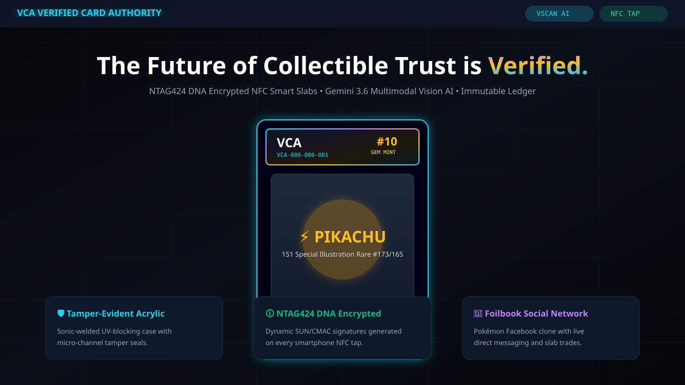
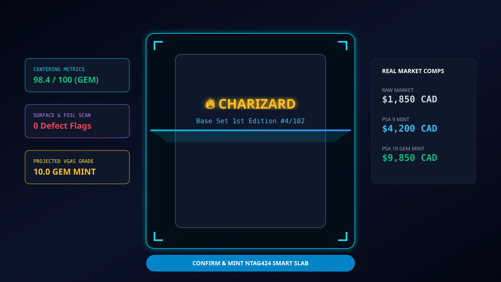
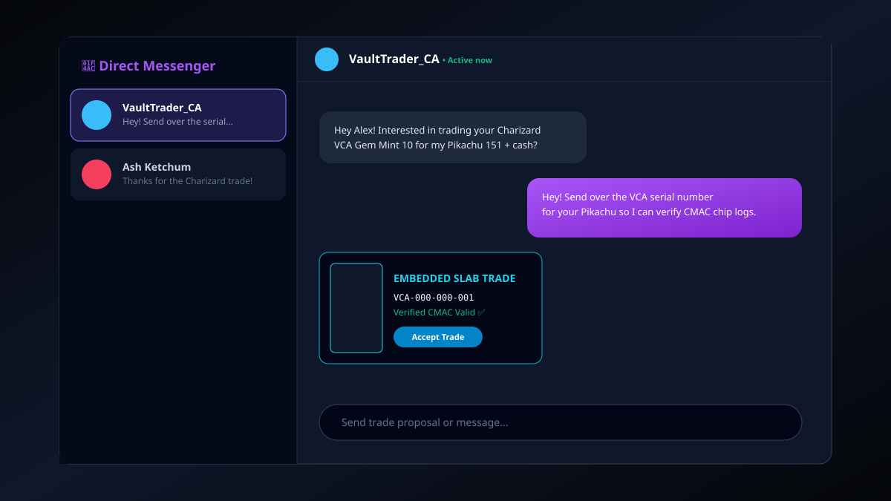

# 🛡️ VCA — VERIFIED CARD AUTHORITY
### *Next-Generation Collectible Authentication, NFC Smart Slabs, AI Grading & Foilbook Social Network*

[](#)
[](#)
[](#)
[](#)
[](#)

**VCA (Verified Card Authority)** is an enterprise-grade collectible trading card grading, authentication, market intelligence, and social ecosystem built specifically for Pokémon card collectors, investors, and hobbyists. 

It seamlessly combines:
* **VScan AI**: Multimodal Computer Vision card scanner powering automated 10-point VGAS condition scoring (Centering, Corners, Edges, Surface).
* **NTAG424 DNA Smart Slabs**: Hardware-encrypted NFC smart slabs with dynamic SUN/CMAC verification signatures to eliminate counterfeit slabs and cloned certificates.
* **Cryptographic Ledger**: SHA-256 hash-chained event ledger tracking complete slab ownership, transfers, digital signatures, and grading history.
* **Real-Time Market Consensus Engine**: Multi-tier market valuation blending Raw, PSA 9, and PSA 10 sales data with custom 30-day index trendlines.
* **Foilbook (Slabbook)**: A Facebook-inspired Pokémon collector social network featuring profile customization, image posts, collection showcases, live 1:1 direct messaging, and embedded slab trade proposals.

---

## 📸 APPLICATION SCREENSHOTS & VISUAL ARCHITECTURE

### 1. 🛡️ 3D Holographic Smart Slab & Landing Hero
*Interactive 3D acrylic slab viewer with holographic label stickers, NTAG424 DNA encryption badge, and real-time vault statistics.*



---

### 2. 📸 VScan AI Camera Scanner & Optical Metric Engine
*10-step guided optical capture pipeline analyzing front, back, low-angle raking shots, 4 corners, and 4 edges with real-time market comps.*



---

### 3. 💬 Foilbook (Slabbook) Collector Social Network & Direct Messenger
*Facebook-style social hub for Pokémon collectors featuring live chat, profile customization, posts, and embedded verified slab trade proposals.*



---

## 🖼️ GUIDE: HOW TO ADD YOUR OWN CUSTOM IMAGES TO THIS README

You can easily replace the diagrams above or add your own live web screenshots, camera capture photos, or slab mockups to this `README.md`. Follow these step-by-step methods:

### Method 1: Local Repo Directory (Recommended for Version Control)

1. **Take your screenshot / picture**: Capture your application running in your browser or a photo of your physical card slab.
2. **Save the image file**: Save it as a PNG or JPG inside the `/docs/` folder in your project directory (e.g., `/docs/my_dashboard_screenshot.png`).
3. **Reference it in `README.md`**:
   ```markdown
   
   ```
4. **Commit & Push**:
   ```bash
   git add docs/my_dashboard_screenshot.png README.md
   git commit -m "docs: add custom dashboard screenshot"
   git push origin main
   ```

---

### Method 2: Drag and Drop via GitHub Web Interface (Easiest & Cloud-Hosted)

1. Open your GitHub repository in your web browser.
2. Click on **`README.md`** and select the **Edit (pencil icon)** button.
3. Drag and drop any `.png`, `.jpg`, or `.gif` image directly into the markdown editor text area.
4. GitHub will automatically upload the image to their secure CDN and generate a URL link like this:
   ```markdown
   
   ```
5. Click **Commit changes...** at the top right.

---

### Method 3: Using Image HTML Tags for Centering and Custom Sizing

If you want custom widths, borders, or centered layouts for your screenshots:

```html
<p align="center">
  
</p>
```

#### Recommended Image Specifications:
* **Resolution**: 1920×1080 (1080p) or 2560×1440 (1440p) for high-DPI crispness.
* **Format**: `.png` (for crisp UI text) or `.svg` (for vector graphics).
* **Aspect Ratio**: 16:9 for full-screen dashboards, 4:3 for card detail closeups.

---

## ⚡ CORE FEATURE BREAKDOWN

### 1. 📸 VScan AI Camera & VGAS 10-Point Condition Scoring
* **Multimodal Card Recognition**: Powered by Google Gemini 3.6 Vision for instant card identification (Set, Number, Rarity, Illustrator, Language, and Print Variant e.g. 1st Edition, Holo, SIR, Alt Art).
* **10-Stage Guided Capture**:
  1. Card Variant Detection
  2. Front Flat Shot with scanline HUD sweep
  3. Reverse Flat Shot
  4. Low-Angle Raking Shots (Left & Bottom Edges for warping/bowing detection)
  5. Corner Close-Ups (×4) with reticle zoom
  6. Edge Close-Ups (×4)
  7. Centering Margins Computation
  8. AI Condition Summary Breakdown
  9. Submission Queueing
  10. NTAG424 Serial Minting (`VCA-XXX-XXX-XXX`)
* **VGAS Scoring**: Computes subgrades for **Centering**, **Corners**, **Edges**, and **Surface**.

---

### 2. 🛈 NTAG424 DNA Encrypted Smart Slabs & Cryptographic Ledger
* **Hardware CMAC Verification**: Uses Web NFC (`NDEFReader`) to read dynamic SUN/CMAC cryptographic signatures embedded in NTAG424 DNA chips.
* **Tamper & Clone Detection**: Validates physical slab serial numbers against the append-only ledger to detect cloned labels or physical slab tampering.
* **Digital Ownership Signatures**: Current slab owners can apply a cryptographic cursive signature directly onto their slab record.
* **Transfer Certificates**: Generates verifiable PDF-style transfer certificates when transferring or selling slabs.

---

### 3. 📊 Investment Dashboard & Vault Analytics
* **Real-Time Valuation**: Blends Raw, PSA 9, and PSA 10 market prices into a live Vault Index.
* **Recharts Visualizations**: 30-day valuation performance curves and interactive set allocation donut charts.
* **Vault Management**: View, filter, and organize owned slabs with quick NFC tap verification checks.

---

### 4. 💬 Foilbook (Slabbook) Pokémon Collector Social Network
* **Facebook-Style Social Feed**: Share card pulls, showcase graded slabs, and post updates to the collector community.
* **Profile Customization**: Custom avatar uploads, cover banners, collector bio, location, and verified trader badges.
* **Live Direct Messenger**: Real-time 1:1 chat with active online status indicators and embedded slab trade proposals.

---

### 5. 📺 Breaking Market Wire & Real-Time Price Ticker
* **Scrolling Marquee**: Top-of-page CNN-style ticker streaming real-time sales alerts, auction records, and market movements.
* **Interactive News Broadcast Room**: Drawer overlay detailing rare card price movements (Charizard 1st Ed, Pikachu 151 SIR, Umbreon VMAX Alt Art).

---

### 6. 🛍️ Verified Marketplace & Live Auctions
* **Live Auction Rooms**: Real-time countdown timers, live bid ticker, watcher counters, and animated high-bid pulses.
* **Buy-Now & Offer System**: Negotiate trades and purchase verified slabs backed by zero-fraud escrow logs.

---

## 🛠️ TECH STACK & SYSTEM DEPENDENCIES

| Layer | Technologies |
| :--- | :--- |
| **Frontend Framework** | React 18, TypeScript, Vite |
| **Styling & UI** | Tailwind CSS, Lucide React Icons |
| **Data Visualization** | Recharts (Valuation curves, Set Allocation) |
| **AI Vision Engine** | Google Gemini 3.6 Multimodal API |
| **Hardware Integration** | Web NFC API (`NDEFReader`), Web Camera API |
| **State & Storage** | LocalStorage Reactive Sync Service, Auth Service |

---

## 📁 PROJECT DIRECTORY STRUCTURE

```
pokemon-scanner/
├── docs/                        # Diagram assets and documentation screenshots
│   ├── hero_3d_slab.svg         # 3D Slab Landing Graphic
│   ├── vscan_ai_scanner.svg     # VScan AI Camera Reticle Graphic
│   └── foilbook_social.svg      # Direct Messenger & Foilbook Graphic
├── src/
│   ├── components/              # UI Components
│   │   ├── BreakingWire.tsx     # CNN News Ticker
│   │   ├── FoilbookView.tsx     # Facebook Clone Social Network & Chat
│   │   ├── GradingSubmissionWizard.tsx  # VScan AI 10-Step Submission
│   │   ├── NfcModal.tsx         # NTAG424 CMAC Tap Verification
│   │   ├── ProfileView.tsx      # Collector Profile & Avatar Uploads
│   │   └── Slab3DViewer.tsx     # Interactive 3D Holographic Slab
│   ├── services/                # LocalStorage & Auth Reactive Stores
│   ├── types/                   # TypeScript Type Definitions
│   ├── App.tsx                  # Root View Controller & Layout
│   ├── main.tsx                 # Entry Point
│   └── index.css                # Custom HUD Animations & Glitch FX
├── public/                      # Static Assets
├── .env.example                 # Environment Variables Template
├── package.json                 # Dependencies & Build Scripts
└── README.md                    # Platform Documentation
```

---

## 🚀 QUICK START & LOCAL DEVELOPMENT

### Prerequisites
* **Node.js**: v18.0.0 or higher
* **npm** or **bun**

### Installation Steps

1. **Clone the repository**:
   ```bash
   git clone https://github.com/t-sinclair2500/pokemon-scanner.git
   cd pokemon-scanner
   ```

2. **Install dependencies**:
   ```bash
   npm install
   ```

3. **Configure Environment Variables**:
   Copy `.env.example` to `.env` and set your optional Gemini API key:
   ```bash
   cp .env.example .env
   ```

4. **Start the Development Server**:
   ```bash
   npm run dev
   ```

5. **Open in Browser**:
   Navigate to `http://localhost:3000` to access the live application.

---

## 📄 LICENSE

This project is licensed under the **MIT License**.

*Copyright © 2026 VCA Verified Card Authority. All Rights Reserved.*
